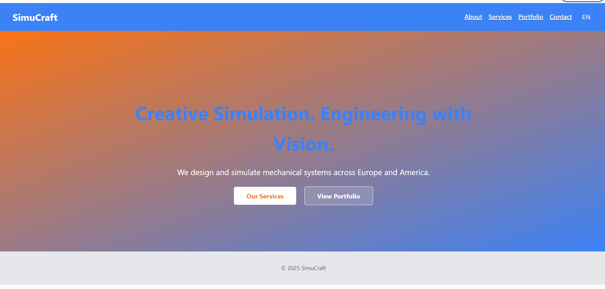

# simucraft-site
# 🌐 SimuCraft Website

Welcome to the official source code of **SimuCraft**, a multilingual, responsive landing page for a creative engineering studio specializing in CAD, simulation, and mechanical design.

---

## ✨ Features

- 💡 Landing Page with brand message and CTA
- 🌍 Multilingual support (English 🇬🇧 & Deutsch 🇩🇪)
- 🎨 Clean responsive design using HTML & CSS
- 🖼️ Image gallery for portfolio
- 📁 Modular code structure for easy extension
- 🌐 Ready for deployment with GitHub Pages

---

## 🛠️ Technologies Used

- HTML5 & CSS3
- JavaScript (vanilla) with dynamic i18n logic
- Git & GitHub for version control
- Responsive Grid Layout
- Optional: Email integration via backend or services like Formspree

---

## 📂 Folder Structure

simucraft-sitw/ 
├── index.html 
├── about.html 
├── services.html 
├── portfolio.html 
├── contact.html 
├── style.css 
├── script.js 
└── lang/ 
  ├── en.json 
  └── de.json

---

## 🚀 Deployment

The site can be hosted using **GitHub Pages**.

> Want to see it live? → [https://Parisa1604.github.io/simucraft-sitw](https://Parisa1604.github.io/simucraft-sitw) *(after activation)*

---

## 📬 Contact

Feel free to reach out via: `info@simucraft.com`  
Or visit the [Contact page](contact.html) to send a message.

---

## 📝 License

MIT License — free to use, modify, and share. Give credit where it's due 💫

---

